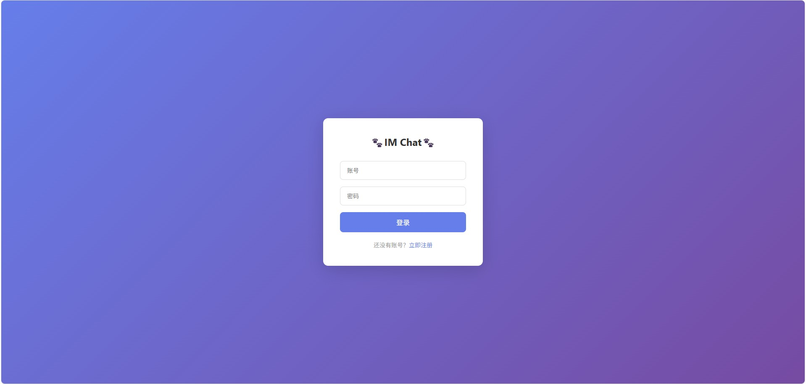
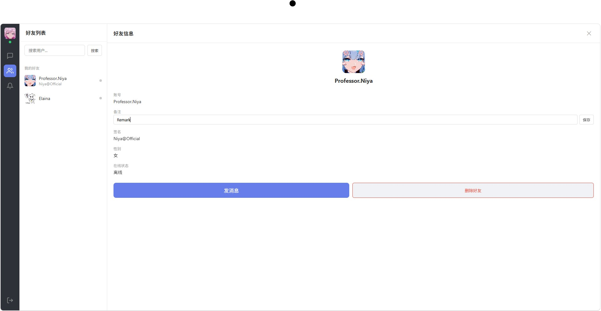
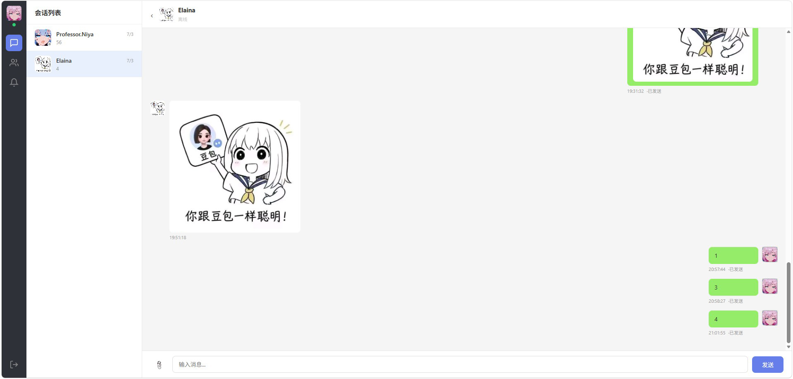

# Go-IM-Systemt
基于 GoZero 微服务架构构建的分布式即时通讯(IM)系统，集成 LLM 接入能力，同时支持基础即时通讯业务与智能化对话场景。

## 项目简介
本项目采用 **Gateway / API / RPC** 三层微服务架构搭建分布式 IM 系统，完整实现即时通讯核心业务，同时接入大模型能力，提供 AI 智能体对话、群聊消息总结、群机器人等扩展功能。
适用于私有聊天服务、企业内部通讯、AI 对话机器人集成等场景。

## 技术栈
### 后端
- **开发语言**：Golang
- **微服务框架**：go-zero
- **通信协议**：gRPC、HTTP、WebSocket
- **ORM**：GORM
- **数据库**：MySQL
- **缓存**：Redis
- **消息队列**：RabbitMQ
- **分布式文件存储**：SeaweedFS-S3
- **容器化部署**：Docker
### Web
- **VUE**
- **JS**

## 架构分层
- 客户端
-    ↓
- Gateway 网关层 （连接管理、消息路由、长连接维护、心跳检测）
-    ↓
- API 服务层 （http 接口、参数校验、鉴权、请求转发）
-    ↓
- RPC 微服务层 （用户、关系、聊天、AI ）

| Service            | Entry                       | Type              | Port  | etcd key      |
|--------------------|-----------------------------|-------------------|-------|---------------|
| `rpc/user`         | `rpc/user/user.go`          | gRPC              | 9001  | `user.rpc`    |
| `rpc/relation`     | `rpc/relation/relation.go`  | gRPC + MQ consumer| 9002  | `relation.rpc`|
| `rpc/chat`         | `rpc/chat/chat.go`          | gRPC              | 9003  | `chat.rpc`    |
| `rpc/ai`           | `rpc/ai/ai.go`              | gRPC + MQ consumer| 9004  | `ai.rpc`      |
| `api`              | `api/api.go`                | REST (HTTP)       | 8888  | —             |
| `gateway`          | `gateway/gateway.go`        | REST + WebSocket  | 8889  | —             |
